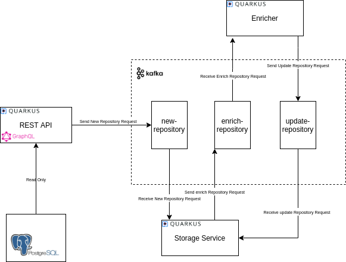

[](https://quarkus.io/)
[](https://www.apache.org/licenses/LICENSE-2.0)
[](https://github.com/quarkusio/quarkus/actions/runs/113853915/)

# Quarkus Catalog Apps

The goal of this application is to automatically analyze Github/Gitlab repositories using Quarkus to extract information like Quarkus version and Quarkus extensions in use.

## Use Cases

- Register GitHub/Gitlab repositories
- Enrich repository data to populate Quarkus extensions and version
- Get the repository data
- Get list of all the registered repositories
- Get statistics of the populated data from all the repositories

## Architecture



## Getting Started

### Prerequisites

- Maven 3.6.X or higher
- JDK 11
- Docker
- docker-compose

### Local Deployment

- Run Kafka and PostgreSQL using docker-compose:

```
cd deployment/docker
docker-compose up
```  

You can also run these components manually following the Kafka instructions [here](https://kafka.apache.org/quickstart) and the next command to run a PostgreSQL instance:

```
docker run -it --name quarkus-app-catalog-postgres -e POSTGRES_USER=sarah -e POSTGRES_PASSWORD=connor -e POSTGRES_DB=quarkusappcatalog -p 5432:5432 postgres:10.5
``` 

- Build:

```
mvn clean install
```

- Start Storage Service:

```
java -jar storage-service/target/storage-service-1.0.0-SNAPSHOT-runner.jar
```

| Note that the storage service will initialize the database if it does not exist.

- Start REST API:

```
java -jar rest-api/target/rest-api-1.0.0-SNAPSHOT-runner.jar
```

- Register a repository:

```
curl -X POST -H "Content-type: application/json" --data '{ "repoUrl": "http://github.com/user/repo" }' "http://localhost:8081/repository"
```

Now, you should see this log in the storage service:

```
(vert.x-worker-thread-0) New repository 'http://github.com/user/repo' with ID 1
```

- Get the repo details

```
curl -X GET -H "Content-type: application/json" "http://localhost:8081/repository/1"
```

And it should return:

```
{"id":1,"repoUrl":"http://github.com/user/repo"}
```

### Images

- Build:

```
mvn clean package
```

- Push Images to your registry:

```
docker login [your_registry]

docker tag quarkus-qe/quarkus-apps-catalog-storage-service:[current_version] [your_registry]/[your_namespace]/quarkus-apps-catalog-storage-service:[current_version]
docker push [your_registry]/[your_namespace]/quarkus-apps-catalog-storage-service:[current_version]

docker tag quarkus-qe/quarkus-apps-catalog-enricher:[current_version] [your_registry]/[your_namespace]/quarkus-apps-catalog-enricher:[current_version]
docker push [your_registry]/[your_namespace]/quarkus-apps-catalog-enricher:[current_version]

docker tag quarkus-qe/quarkus-apps-catalog-rest-api:[current_version] [your_registry]/[your_namespace]/quarkus-apps-catalog-rest-api:[current_version]
docker push [your_registry]/[your_namespace]/quarkus-apps-catalog-rest-api:[current_version]
```

- Environment Properties for REST API and Storage Service:

```
QUARKUS_DATASOURCE_USERNAME=XXX
QUARKUS_DATASOURCE_PASSWORD=YYY
QUARKUS_DATASOURCE_JDBC_URL=jdbc:postgresql://XXX:YYY/quarkusappcatalog
QUARKUS_HIBERNATE-ORM_DATABASE_DEFAULT-SCHEMA=quarkusappcatalog
KAFKA_BOOTSTRAP_SERVERS=...
```

- Environment Properties for Enricher Service:

```
KAFKA_BOOTSTRAP_SERVERS=...
```

## Useful Links

- [Board](https://trello.com/c/RcosHgqo)
